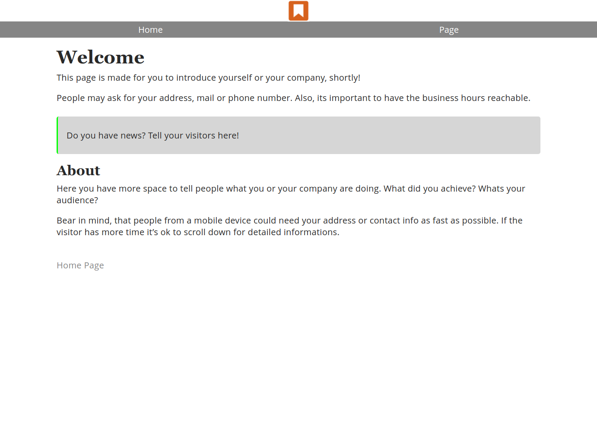

# Businesscard

A theme for Hugo, providing you with a simple business card.



## Getting Started

Install Hugo <https://gohugo.io/getting-started/installing/>

Add the theme

```shell
git submodule add https://github.com/abaldeweg/businesscard.git themes/businesscard
```

Add `theme = 'businesscard'` to your `config.toml`. You can copy the other options from `themes/businesscard/config.toml`.

There is a template for your first page under `exampleSite/content/_index.md`, which you can copy to your own `content/` dir. More sites can be created with the command `hugo new [FILE]` e.g. `hugo new page.md`.

Start the live server with `hugo server -D`.

Build the site with `hugo -D` and upload the files to your webspace.
